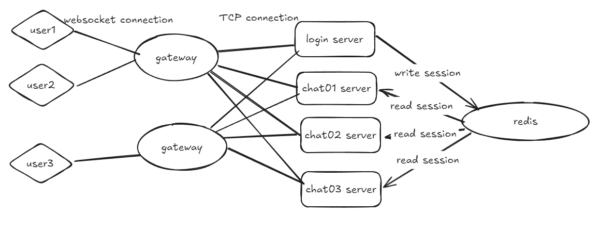

# cirno-im整体设计大纲

## 大致架构

网关：sdk侧实际与网关建立长连接，进行消息监听。并且可以将鉴权限流等逻辑分离到网关内。

逻辑服务：实际的业务处理，包含登录服务，聊天服务等。因为需要位置网关与逻辑服务起的会话，所以是有状态服务，可以通过一个redis将状态解耦，单独保存会话信息。

这是整体的架构，对于后端项目本身更加细分来讲，还存在以下层：

* 通信层： 正如上述所说，sdk与gateway实际建立的连接为ws连接，但是gatewway与logic server通信使用的是裸的tcp协议，用以加快通信效率。所以需要建立一个通信层，用以屏蔽websocket和裸的tcp协议之间的差异。

* 容器层：主要用于托管Server、维护服务的依赖关系、处理消息上下行。简单来讲其实就相当于一个中间层，用于解耦业务层和通信层。

* 链路层：

    - **节点连通链路**：在中间层之容器中，调用`kim.Dialer`接口中的`DialAndHandshake`方法实现**连接与握手**。同时在逻辑服务端`Accept`回调中就要处理网关发送的`握手包`。
    - **消息处理链路**：
        - 从SDK端出发，会有一个登录的过程。之后就是消息的发送，到达网关的Server端之后，通过消息监听器`Receive`回调给了业务层处理器`handler`，在`handler.Receive`方法中，传入的[]byte数据会被解包成**LogicPkt**对象，然后通过容器的调度转发到`Chat`服务中。
        - 在Chat中也是同样的逻辑，消息被Server回调给`handler.Receive`处理之后，就会调用指令路由器`Router`的`Serve`方法处理这条消息。在逻辑服务启动时，会把`指令处理器`注册到Router中，所以在Router.Serve方法内部可以根据消息头中的`Command`查找到对应的指令处理器。

## 消息可靠投递

对于即时通讯系统而言，有两个重要指标：``可靠投递``和`及时投递`，可靠投递要求系统在-复杂的网络环境或者服务故障的情况下可以尽量保证消息不丢失，及时投递则是要求发送的消息可以尽快的送达到对方，如果对方处于离线状态，则需要通过推送服务将消息异步的投递过去。

**为了保证离线消息，发送方投递的消息在到达了chat服务之后，首先就是写入离线队列内，不管接收方是否在线**。为了保证额消息的投递成功，我们需要接收方主动告知服务端（返回一个ack消息），然后服务端将该条消息设置为已读，服务端是无法感知到客户端是否已经将消息持久化到本地存储了的。

但是这里存在一个问题，就是对于即时通讯系统而言，消息量是十分巨大的，如果说每一条消息都返回一个ack势必会对服务端造成巨大的影响。**由于消息是连续的，所以这里可以采用将多条消息合并为一个ack**，这样一个ack消息就可以保证多条消息已读了。

而对于客户端sdk侧而言，sdk发送消息之后需要等待服务端做出回应，如果说受到的resp不是success状态，sdk侧需要做出相应的处理，包含但不限于：

1. 消息重发
2. 断线重连
3. 错误上报

而对于离线逻辑而言，离线用户上线后需要从服务端拉取离线消息，以此进行消息同步。同步的方式一般有Pull和Push两种，字如其意，Pull是指客户端主动发起请求从服务端拉取消息，Push则是服务端主动向客户端发送请求。在本次的cirno-im中采用了Pull的方式处理离线逻辑。

而对于消息表的设计，比较常见的设计方案是直接添加一个delivered标志位用以标识是否已读，但是还是那个原因，我们的即时通讯系统存在百万级消息量，数据库的io操作是及其耗时的，如果这么设计，同步离线消息的时候将会设计大量的数据库更新操作，对性能造成影响。  
因此我们通过给每个用户在服务端添加一个`读索引`，而同时与SDK约定一条规则，`即在ACK时，只需要给一条发送时间最大的消息ID即可`。这样，就可以标识在这个id之前的所有id都已经被读取完毕了。使用读索引的另一个好处就是SDK登录之后，第一次请求离线消息时，可以把**本地数据库**中`最后一条消息的ID`作为`latest_ack_msg_id`的值，这样可以近一步解决本地SDK的读索引与服务端读索引不一致导致的消息重复同步。比如本地的最大读消息索引为`18`，因为SDK**最后一批消息**还没有ACK给服务端就离线了，此时服务端的读了索引为`10`，那么第一次同步消息时，就可以`减少8条消息`的同步。

另外，如果说一个用户在很长时间内没有上线。突然上线势必遗留大量的离线消息。如果这个时候进行同步就会导致一个问题，用户的程序会阻塞在这个同步过程，造成使用体验下降，这里的采用的方法是将消息索引和消息内容分离，同步的时候只用同步索引就好了，实际想查看会话的时候跟你局索引动态的加载消息内容即可。

### 消息存储与离线同步

#### 同步or异步？

对于消息是同步存储还是异步存储？

* 同步存储：消息写入数据库，事务提交完成后返回。
    * 优点：实现简单，消息几乎不会丢失
    * 缺点：需要等待消息落盘，实际存储在数据库内，写性能瓶颈，直接影响消息吞吐量。
* 异步存储：消息写入高速缓存或者其他的消息中间件内，然后有其他的线程将消息中间件内的消息同步到数据库内
    * 优点：性能高，发送方只需要往中间件内发送消息就行了，不需要同步阻塞。
    * 缺点：难以保证额消息可靠性，有概率导致消息丢失。

最终考量上，决定使用同步存储的方式。

#### 存储设计

扩散写：对于每一个用户而言都会维护一个离线队列，扩散写就是用户在群组内发送消息，最终的结果就是给每一个用户的离线队列都会写一条消息。

读扩散：消息不会写多份，每个发送者和接受者之间会有一个独立的队列，最后读取消息的时候会从每一个队列内都读取离线消息。

cirno-im采用写扩散模型，主要是考虑到逻辑更简单容易实现，并且对于读扩散而言最终。

